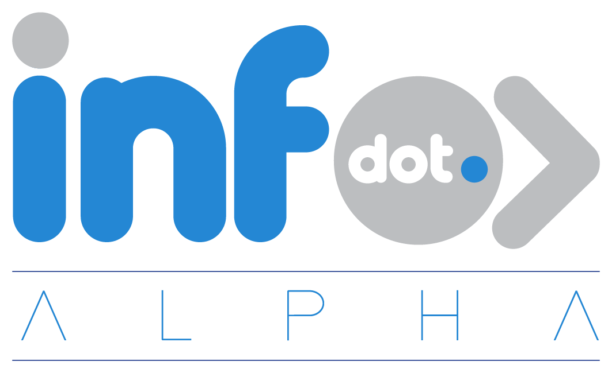

<div align="center">



<h3>The Dot Ecosystem Hub</h3>

<p>Log in once — access every Dot platform seamlessly.</p>

[](https://php.net)
[](https://laravel.com)
[](https://livewire.laravel.com)
[](https://postgresql.org)
[](https://reverb.laravel.com)
[](tests/)
[](LICENSE)

</div>

---

## What is InfoDot?

InfoDot is the **authentication hub and discovery layer** for the Dot ecosystem — 16 purpose-built micro-platforms for seamless business transactions. Users register once through InfoDot and navigate any Dot platform without re-authenticating, via short-lived SSO tokens issued against a shared PostgreSQL instance.

Beyond SSO, InfoDot is a knowledge and collaboration platform: a solutions hub, Q&A forum, social graph, team management suite, and real-time notification centre.

---

## Core Features

- **Solutions Hub** — step-by-step guides authored and discovered by the community
- **Q&A Forum** — threaded questions with solved status and voted answers
- **Threaded Comments & Likes** — polymorphic reactions across all content types
- **Social Graph** — follow users, build associate networks, activity feeds
- **Team Management** — invite members, assign roles, collaborate across platforms
- **Real-time Notifications** — Laravel Reverb WebSockets
- **Full-text Search** — Laravel Scout across users, solutions, questions, and comments
- **Ecosystem SSO** — `POST /api/ecosystem/token` issues 5-min handoff tokens for all 16 platforms
- **Dot Switcher** — dashboard widget with one-click access to every Dot platform

---

## Ecosystem SSO Flow

```
User logs in → InfoDot issues a short-lived Sanctum token (5 min, ecosystem:read)
→ User clicks a Dot platform in the switcher
→ Redirect: satellite-app.infodot.app/auth/ecosystem?token=<token>
→ Satellite verifies token, logs user in, deletes token (one-time use)
```

---

## The Dot Ecosystem

| Platform | Description |
|---|---|
| [Dot.Files](https://github.com/sakhileb/Dot.Files) | Secure team file storage and sharing |
| [Dot.Agents](https://github.com/sakhileb/Dot.Agents) | Enterprise AI workforce platform |
| [Dot.docs](https://github.com/sakhileb/Dot.docs) | Collaborative document management |
| [Dot.Forms](https://github.com/sakhileb/Dot.Forms) | Form builder and submission management |
| [Dot.Sheet](https://github.com/sakhileb/Dot.Sheet) | Collaborative spreadsheets |
| [Dot.Engage](https://github.com/sakhileb/Dot.Engage) | Client engagement — contracts, chat, video |
| [Dot.Press](https://github.com/sakhileb/Dot.Press) | AI-powered presentation builder |
| [Dot.Projects](https://github.com/sakhileb/Dot.Projects) | Project management with AI planning |
| [Dot.Tasks](https://github.com/sakhileb/Dot.Tasks) | Task management with AI breakdown |
| [Dot.Finance](https://github.com/sakhileb/Dot.Finance) | Financial management and budgeting |
| [Dot.Emall](https://github.com/sakhileb/Dot.Emall) | Online marketplace |
| [Dot.Auction](https://github.com/sakhileb/Dot.Auction) | Real-time auction platform |
| [Dot.Ehail](https://github.com/sakhileb/Dot.Ehail) | E-hailing and ride management |
| [Dot.Tutor](https://github.com/sakhileb/Dot.Tutor) | Tutoring and session booking |
| [Dot.Design](https://github.com/sakhileb/Dot.Design) | AI-powered canvas design tool |
| [Dot.Central](https://github.com/sakhileb/Dot.Central) | AI agent hub and conversation manager |

---

## Tech Stack

| Layer | Technology |
|---|---|
| Framework | Laravel 12 + PHP 8.4 |
| Frontend | Livewire 3 + Alpine.js 3 + DaisyUI 5 |
| Auth | Jetstream 5 + Sanctum 4 |
| Database | PostgreSQL 16 (shared across all Dot platforms) |
| Search | Laravel Scout (TNTSearch dev / Meilisearch prod) |
| WebSockets | Laravel Reverb |
| Assets | Vite 7 |
| Monitoring | Sentry |
| Static analysis | PHPStan level 5 |

---

## Quick Start

```bash
git clone https://github.com/sakhileb/InfoDot.git && cd InfoDot
composer install && npm install
cp .env.example .env && php artisan key:generate
php artisan migrate
npm run dev & php artisan serve
```

```bash
php artisan reverb:start    # WebSockets :8080
php artisan queue:work      # Queue worker
bash bin/test.sh            # 84 tests passing
./vendor/bin/phpstan analyse --level=5
```

---

MIT — © SK Digital / BluPin Incorporated
