<div align="center">



<br /><br />

**Log in once — access every Dot platform seamlessly.**

<br />

   

<br /><br />

**Part of the [InfoDot Ecosystem](https://github.com/sakhileb/InfoDot)** &nbsp;·&nbsp; `infodot.app`

</div>

---

## What is InfoDot?

InfoDot is the central identity hub for the Dot ecosystem — a unified gateway giving users single sign-on access to 21 micro-platforms built for seamless business operations. Authenticate once and move freely between every connected Dot platform without re-entering credentials.

## Core Features

- Single Sign-On (SSO) via Sanctum handoff tokens (5-min TTL)
- Solutions hub — community knowledge base with polymorphic likes
- Q&A forum with threaded comments
- Team management — invitations, roles, and multi-tenancy
- Real-time notifications via Laravel Reverb
- Full-text search across solutions, questions, and users
- Social graph — follow users, build your network
- Dot Switcher — navigate all 21 platforms from one sidebar widget
- File uploads backed by AWS S3 or local disk

## Domain Models

- **User** — identity, profile, social graph
- **Team** — multi-tenant workspace with roles
- **Solution** — knowledge articles with tagging
- **Question / Answer** — threaded Q&A forum
- **Notification** — real-time alert feed
- **File** — attachment storage

## Tech Stack

| Layer | Technology |
|---|---|
| Framework | Laravel 12 |
| Language | PHP 8.4 |
| Frontend | Livewire 3 · Alpine.js 3 · Tailwind CSS |
| Database | PostgreSQL 16 (shared across ecosystem) |
| Realtime | Laravel Reverb |
| Auth | Laravel Sanctum (InfoDot SSO) |
| AI | Anthropic Claude (`claude-sonnet-4-6`) |
| Storage | AWS S3 / Local (Flysystem) |
| Search | Laravel Scout · Meilisearch |
| Queue | Redis · Laravel Horizon |

## Quick Start

```bash
git clone https://github.com/sakhileb/InfoDot.git
cd InfoDot
cp .env.example .env
composer install
npm install && npm run build
php artisan key:generate
php artisan migrate
php artisan serve
```

> **Ecosystem SSO:** Set `DB_*` env vars to the shared InfoDot PostgreSQL instance and `APP_URL=https://infodot.app`. Users authenticated through InfoDot gain access automatically via Sanctum handoff tokens.

## Ecosystem

**InfoDot** is one of **21 platforms** in the InfoDot ecosystem, connected via shared PostgreSQL and Sanctum SSO. Visit [InfoDot](https://github.com/sakhileb/InfoDot) to explore the full platform map.

## License

MIT © [SK Digital / BluPin Incorporated](https://github.com/sakhileb)
